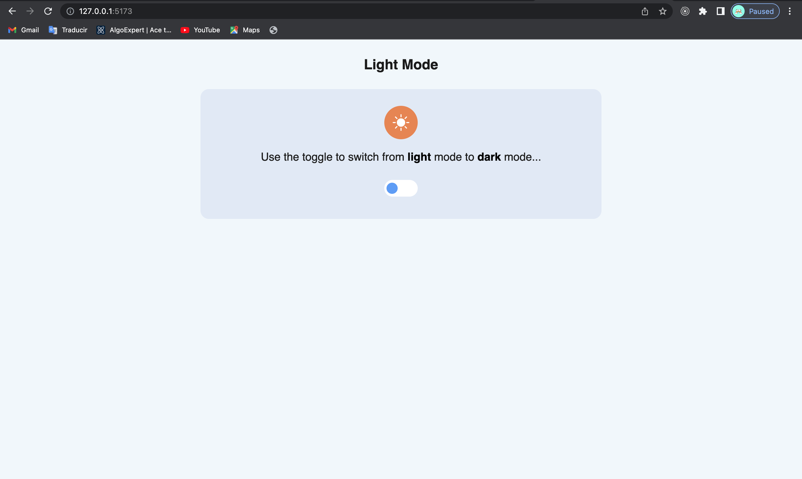

## 🧐 Dark mode - Switch

> This is a switch component to toggle between dark and light themes.

## 🔧 Built With

- TypeScript
- JSX
- CSS
- React
- React Icons

## 🛠 Getting Started

To get a local copy up and running follow these simple example steps.

- Go to the main page of te repo.
- Press the `Code` button and get the repo link.
- Clone it using git.

## ✒️ Authors

👤 **Unicorn Dad**

- [@UnicornDad8](https://github.com/UnicornDad8)

## 🤝 Contributing

Contributions, issues and feature requests are welcome!

Feel free to check the [issues page](https://github.com/UnicornDad8/dark-mode/issues).

## 📝 License

This project is [MIT](lic.url) licensed.
